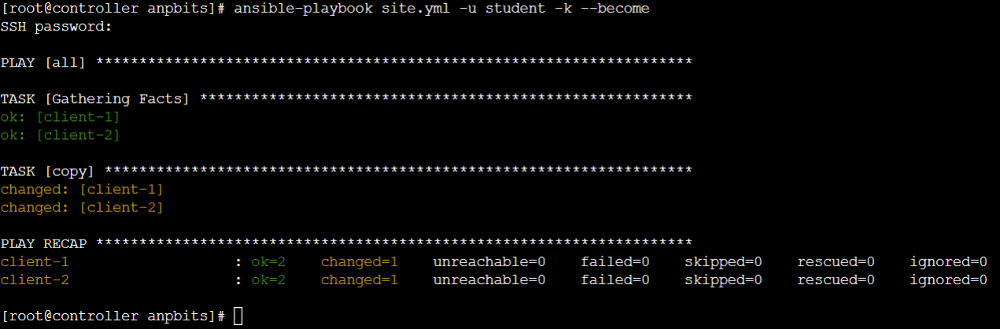
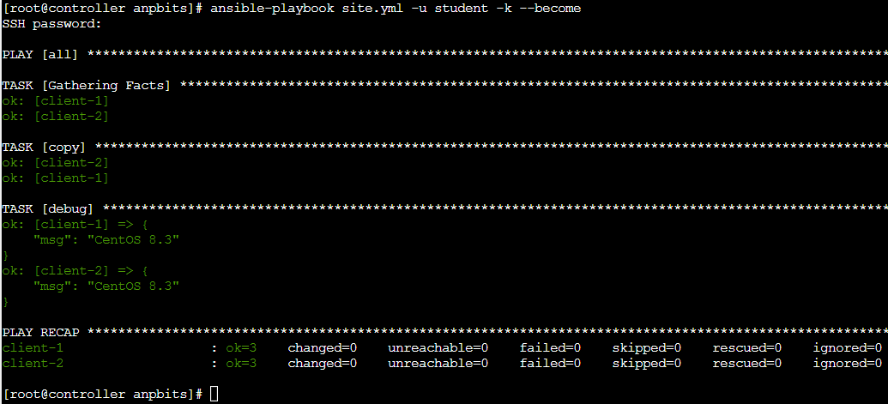
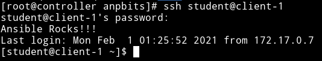

# anpbits - Ansible na prática

[English version](README_en.md)
<br>
<br>

## Começando do jeito fácil. (É necessário ter conexão com a internet)


- Acesse a página [Docker Playground](https://labs.play-with-docker.com)

- Faça login com sua conta Docker. Ou crie uma se você ainda não tiver.

- Faça o download do arquivo docker-compose.yml and run docker-compose up
    
    ``` bash
    DOCKER_COMPOSE_URL='https://raw.githubusercontent.com/henriqueccapozzi/anpbits/main/docker-compose.yml'
    mkdir anpbits && cd anpbits && \
    curl ${DOCKER_COMPOSE_URL} -o docker-compose.yml && \
    docker-compose up -d
    ```
## Pré requisitos desejáveis

O ansible é uma ferramenta muito poderosa porem possui uma distinta 
capacidade de ser 'simples' de entender. Por isso, para tirar o maior 
proveito possível desse projeto é desejável (porem não obrigatório) que 
você possua um pouco de conhecimento nos seguintes tópicos:

- docker
- docker-compose
- python
- yaml
- linux básico

<br>
<br>

## O script `setmeup`

Bom para facilitar o uso deste projeto a imagem que vamos utilizar
para o controlador, possui um script chamado `setmeup` para 
preparar o ambiente até a lição desejada

Logo caso você queira começar de alguma lição que não seja a primeira basta fazer o seguinte:

```bash
# Exemplo de inicio na lição 4
setmeup --lesson 4
```

Fazendo isso todos os passos necessários para iniciar na lição
escolhida vão ser realizados de forma automatizada

<br>

---


<br>

## Índice

- [Lição 1 - Primeiro comando ansible](#l1)

- [Lição 2 - Adicionando nossos primeiros hosts ao inventario](#l2)

- [Lição 3 - Instalando o python nos nossos alvos](#l3)

- [Lição 4 - Executando nosso primeiro playbook](#l4)

<br>
<br>
<br>
<br>


## <a id="l1"></a> Lição 1 - Primeiro comando ansible
[Voltar para o Índice](#Índice)

O Ansible usa conexões SSH para muitos de seus modulos. Mas nossa maquina que ira rodar o ansible não tem SSH instalado. 

Bom, vamos usar o ansible para nos ajudar com isso

Primeiro precisamos nos 'conectar' com o container usando o comando abaixo

```bash
CONTROLLER_ID=$(docker ps | grep 'controller' | awk '{print $1}')  
docker exec -it ${CONTROLLER_ID} bash
```

Depois disso vamos usar um comando ansible no modo **adhoc** para instalar um pacote usando o 
modulo 'yum'

```bash
ansible localhost -m 'ansible.builtin.yum' -a 'name=openssh-clients' -v
```
Vamos detalhar um pouco o que acabamos de fazer

| Commando | Explicação |
| --- | --- |
*ansible* |  Bom, dispensa comentários
*localhost* | **alvos** para o comando 'ansible'
*-m ansible.builtin.yum* | Nome do **modulo** ansible
*-a name=openssh-clients* | **argumento para o módulo** nome=valor

<br>
Teste o acesso SSH
<br>
<br>

```bash
[root@controller /]$ ssh student@client-1
"The authenticity of host 'client-1 (172.19.0.2)' can't be established.
ECDSA key fingerprint is SHA256:gijXgYcIb+y9Z5gCe3wDmKhnnlXW+ZrfT0KU92IhKWQ.
Are you sure you want to continue connecting (yes/no/[fingerprint])?" 
yes
"Warning: Permanently added 'client-1,172.19.0.2' (ECDSA) to the list of known hosts.
student@client-1's password:" 
# when prompted for a password enter ===> anpbits
anpbits
[student@client-1 ~]$
```
Parabens!

Agora vamos começar a parte boa

<br>
<br>


## <a id="l2"></a> Lição 2 - Adicionando nossos primeiros hosts ao inventario
[Voltar para o Índice](#Índice)

A forma padrão de trabalho do Ansible é de executar ações contra 1 ou mais **alvos**
Na lição passada usamos **localhost** como o alvo do nosso comando, mas apesar de 
ser de grande utilidade automatizar processos no controller do ansible, o grande valor
está em automatizar outros servidores.

Para isso vamos precisar usar um [inventario](#inventario), e para simplificar o aprendizado, vamos criar um no local onde o Ansible vai procurar por padrão. Que é '/etc/ansible/hosts'

```bash
# Na vida real as coisas não estaram sempre prontas ;-)
mkdir -p /etc/ansible

echo 'client-1' >> /etc/ansible/hosts
echo 'client-2' >> /etc/ansible/hosts
```

Além do inventário vamos adicionar alguns parametros de configuração para que as respostas iniciais fiquem mais amigáveis

```bash
export ANSIBLE_PYTHON_INTERPRETER=/usr/libexec/platform-python
export ANSIBLE_HOST_KEY_CHECKING=false
```

Feito isso podemos executar nosso próximo comando 
```bash
ansible all -m ansible.builtin.shell -a 'echo Ola do $(hostname)' -u student -k
# Lembrando que a senha é ==> anpbits
```

Nesse comando temos a adição de novos parâmetros de linha de comando

| Parametro | Explicação |
| --- | --- |
*-u student* |  especifica qual o usuário o ansible vai usar na conexão ssh com os **alvos**
*-k* | faz um prompt para inserir a senha que será usada na conexão ssh
*-m ansible.builtin.shell* | Nome do **modulo** ansible
*-a 'echo Ola do $(hostname)'* | **argumento para o módulo** neste caso o módulo nao tem parâmetros nominais como o usado anteriormente

<br>
<br>


## <a id="l3"></a> Lição 3 - Instalando o python nos nossos alvos
[Voltar para o Índice](#Índice)

Python é a linguagem nativa do Ansible, e grande parte de sua funcionalidade é através do uso de bibliotecas python.
Como nossos 'clientes' simulam uma instalação minima de um sistema centos8 (usando containers), somente uma pequena parte do python esta disponível neles.

Vamos usar o ansible para já deixar nossos clientes 'preparados' para as próximas etapas.

```bash
# Se você não completou a lição 2 agora, faça os preparativos abaixo primeiro
mkdir -p /etc/ansible

echo 'client-1' >> /etc/ansible/hosts
echo 'client-2' >> /etc/ansible/hosts
export ANSIBLE_PYTHON_INTERPRETER=/usr/libexec/platform-python
export ANSIBLE_HOST_KEY_CHECKING=false

# -------------------------------
# Se você já exportou as variaveis anteriormente, contunie daqui
# -------------------------------
ansible all -m ansible.builtin.dnf -a 'name=python38' -u student -k --become
# Lembrando que a senha é ==> anpbits
```


Nesse comando a nossa única novidade é o parametro de linha de comando '--become'
que é usado no ansible para executar comandos no modo privilegiado


<br>
<br>

## <a id="l4"></a>  Lição 4 - Executando nosso primeiro playbook
[Voltar para o Índice](#Índice)

*Importante*: caso você esteja começado por essa lição, será necessário executar o script 'setmeup --lesson 4'

Até agora executamos comandos 'ansible', que são chamados **comandos adhoc**
eles são relativamente simples de usar, porem é fácil de ver que para casos complexos o comando ficaria bem difícil de trabalhar.

Os comandos adhoc são geralmente usados para tarefas pontuais, ou para o que fizemos nas lições de 1 a 3, que foi preparar a infra estrutura necessária para
o que vem pela frente.

### O comando: ansible-playbook

A melhor forma de aproveitar o poder do ansible é usando [playbooks](#playbook)

Um playbook é um arquivo no formato [yaml](https://yaml.org), que especifica o que o ansible deve fazer ao interagir com cada um dos seus alvos.


Vamos fazer um playbook para configurar a mensagem de boas vindas quando um usuário fizer login usando ssh


### Arquivo de playbook
```yaml
# Conteudo do arquivo /anpbits/site.yml
- hosts: all
  tasks:
  - copy:
      content: "Ansible Rocks!!!\n"
      dest: /etc/motd
```
```bash
# Vamos executar nosso playbook
ansible-playbook site.yml -u student -k --become
# Lembrando que a senha é ==> anpbits
```



Mas espera, se olharmos o resultado da execução podemos ver que temos as seguintes seções:

- PLAY [all]
- TASK [Gathering Facts]
- TASK [copy]
- PLAY RECAP

Seguindo o que fizemos nas lições anteriores, vamos olhar mais de perto cada parte:

| Segmento | Explicação |
| --- | --- |
| **PLAY** [all] | Demarca o inicio do playbook
| PLAY **[all]** | Nome do playbook (se existir), ou nome dos **alvos** 
| --- | --- |
| **TASK** [Gathering Facts] | Demarca o inicio de uma tarefa |
| TASK **[Gathering Facts]** | Nome da tarefa (se existir), ou nome do **modulo** |
| --- | --- |
| **TASK** [copy] | Demarca o inicio de uma tarefa |
| TASK **[copy]** | Nome da tarefa (se existir), ou nome do **modulo** |
| --- | --- | 
| PLAY RECAP | Demarca o inicio do resumo da execução do playbook

### Mas de onde veio a 'TASK [Gathering Facts]' ?!
Se olharmos o playbook /anpbits/site.yml vamos encontrar somente 
um módulo sendo usado, que é o modulo 'copy'

Bom, por padrão o ansible adiciona como o primeiro item da lista de tarefas de um playbook,
uma chamada ao modulo 'setup' que utiliza de varios métodos para identificar fatos do host
de destino, como quase tudo no ansible, podemos modificar esse comportamento se quisermos.

Antes de concluirmos essa lição, vamos extrair a versão do sistema de nossos clientes do resultado
da chamada do módulo setup.

Para isso adicione as seguintes linhas ao arquivo /anpbits/site.yml
```yaml
  - debug:
      msg: "{{ ansible_facts.distribution }} {{ ansible_facts.distribution_version }}"
```

Segue o conteúdo final do arquivo para referência
```yaml
- hosts: all
  tasks:
  - copy:
      content: "Ansible Rocks!!!\n"
      dest: /etc/motd
  - debug:
      msg: "{{ ansible_facts.distribution }} {{ ansible_facts.distribution_version }}"
```

Execute novamente o comando
```bash
ansible-playbook site.yml -v -u student -k --become
# Lembrando que a senha é ==> anpbits
```



Olhando a saida da nova execução podemos notar algumas diferenças. Temos agora um novo segmento
de com a primeira linha igual a "TASK [debug]" que contem uma mensagem para cada um dos nossos hosts.

Nessa mensagem podemos ver que nossos clientes estão rodando sistemas Linux CentOS 8.3

Em breve vamos examinar nosso arquivo site.yml, entender o que cada linha faz e adequar ele 
as melhores práticas.
Por hora vamos priorizar entender a saida de tela apresentada pelo ansible.

Vamos focar no segmento "TASK [copy]" e notar o seguinte.

```diff
TASK [copy] *******************************************************
- changed: [client-1]
- changed: [client-2]
+ ok: [client-1]
+ ok: [client-2]
```

Por que na primeira execução tinhamos a linha iniciada com <span style="color: yellow">"changed:"</span> para cada um dos
nossos alvos , já na segunda execução temos uma linha iniciada com <span style="color: green">"ok:"</span>

Se executarmos novamente o mesmo playbook, vamos ver que o segmento "TASK [copy]" ira continuar tendo como resultado 
linhas iniciadas com <span style="color: green">"ok:"</span>


### Validando nossa configuração

Concluímos nossa primeira execução de um playbook, e nada melhor que 'tirar a prova real' que o que fizemos funcionou como esperavamos.

```
ssh student@client-1
```



<br>


## <a id="l91"></a> Lição 90 - Configurando o ansible e primeiro vault
Até agora usamos o ansible no chamado modo **adhoc**, e usamos 2 variaveis 
de ambiente para tornar as respostas um pouco mais amigáveis

Vamos agora explicar essas configurações e coloca-las no seu devido lugar
antes de avançarmos para trabalhar com playbooks


Crie um novo arquivo conforme abaixo

### */etc/ansible/ansible.cfg*
```bash
[defaults]
# Desabilita a verificação da chave ssh dos servidores remotos 
# que o ansible tentar se conectar
# 
# Para executar o ansible em um cenário de produção é recomendado que 
# a linha abaixo seja removida
host_key_checking = False

# Caminho onde o ansible vai procurar um arquivo com a senha
# de arquivos criptografados com o programa 'ansible-vault'
vault_password_file = /.ansible_vault
```
Agora vamos criar o arquivo que vai conter a senha do nosso vault
### */.ansible_vault*
```bash
echo 'anpbits' > /.ansible_vault
## Opcional (em laboratório)
# Para 'garantir' que o arquivo só seja acessível para usuários 
# administradores do sistema execute o comando abaixo 
chmod 0400 /.ansible_vault
```

### Criando no vault
Alem do comando 'ansible', junto com a instalação temos outras utilidades de linha comando, como o ansible-vault que é usado para criptografar dados 
sensíveis como nossas credenciais de acesso.

```bash
ansible-vault create /etc/ansible/credentials.yml
```
Após a execução do comando acima, o ansible-vault vai abrir o programa
[vi/vim](https://www.vim.org) para que você escreva as variáveis que você
quer proteger usando o formato [yaml](https://yaml.org) (exemplo abaixo).

**Observação:** O editor vim é um pouco diferente do que a maioria das pessoas
está acostumada.
De forma bem **simplificada** os comandos que você vai precisar usar estão abaixo
-

| Comando | resultado |
| --- | --- |
i |  ativa o modo de **inserção** no vim, após isso os caracteres que você digitar vão ser inseridos no arquivo
ESC | sai do modo de **inserção**
: | ativa o modo de **comandos** no vim
x (seguido de) ENTER | salva o arquivo que estava sendo editado e fecha o vim


Caso você encontre dificuldades com o


```yaml
ansible_ssh_user: student
ansible_ssh_pass: anpbits
```

Para demonstrar um pouco melhor vamos adicionar um novo 'servidor' a nossa topologia e usar o ansible para instalar e configurar um servidor web

#### Alterando nosso docker-compose


# Definições

#### inventario
#### controller
#### alvo
#### playbook
#### docker & docker-compose
