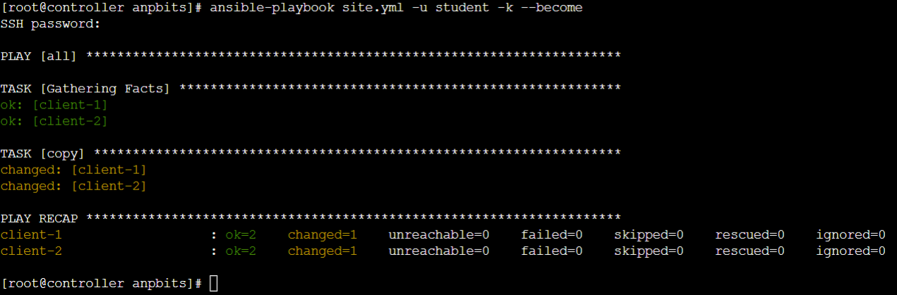

# anpbits - Hands on ansible


## Setting up the easy way. (Requires internet connection)

- Navigate to [Docker Playground](https://labs.play-with-docker.com)

- Log in with you docker account. Or create one if you don't already have one

- Download the docker-compose.yml from this repo and run docker-compose up
    
    ``` bash
    DOCKER_COMPOSE_URL='https://raw.githubusercontent.com/henriqueccapozzi/anpbits/main/docker-compose.yml'
    mkdir anpbits && cd anpbits && \
    curl ${DOCKER_COMPOSE_URL} -o docker-compose.yml && \
    docker-compose up -d
    ```

<br>

## Desired background skills
Ansible is a very powerfull tool, that have a curious capacity of 
being 'simple' to understand. Because of that to get the most out
of the project is recommended (altough not required) that you have
some knowledge in the following topics:

- docker
- docker-compose
- python
- yaml
- basic linux

<br>
<br>

## <a id="index"></a> Table of contents

- [Lesson 1 - Your first ansible command](#l1)

- [Lesson 2 - Adding hosts to our inventory](#l2)

- [Lesson 3 - Installing python on our targets](#l3)

- [Lesson 4 - Running our first playbook](#l4)
 
 <br>
 <br>
 <br>
 <br>

## <a id="l1"></a> Lesson 1 - Your first ansible command
[Back to table of contents](#index)

Ansible uses in most cases ssh to manage remote hosts, but seems like our controller node does not have ssh installed.

Well lets run our first ansible commands to help up set up ansible =)

First `attach` to the container with

```bash
CONTROLLER_ID=$(docker ps | grep 'controller' | awk '{print $1}')
docker exec -it ${CONTROLLER_ID} bash
```

Then, run the following command
```bash
ansible localhost -m 'ansible.builtin.yum' -a 'name=openssh-clients' -v
```
Lets break it down a little more.

| Command | Explanation |
| --- | --- |
*ansible* |  Well, there's not much to say about that one
*localhost* | the ansible command **target host**
*-m ansible.builtin.yum* | ansible **module** name
*-a name=openssh-clients* | ansible **module argument** name=value

<br>
Test your ssh access

```bash
[root@controller /]$ ssh student@client-1
"The authenticity of host 'client-1 (172.19.0.2)' can't be established.
ECDSA key fingerprint is SHA256:gijXgYcIb+y9Z5gCe3wDmKhnnlXW+ZrfT0KU92IhKWQ.
Are you sure you want to continue connecting (yes/no/[fingerprint])?" 
yes
"Warning: Permanently added 'client-1,172.19.0.2' (ECDSA) to the list of known hosts.
student@client-1's password:" 
# when prompted for a password enter ===> anpbits
anpbits
[student@client-1 ~]$
```
Congratulations!

Now let's start with the good stuff 

<br>
<br>

## <a id="l2"></a> Lesson 2 - Adding hosts to our inventory
[Back to table of contents](#index)


The standard way that ansible works is executing actions agains 1 or more **targets**
In the previous lesson we used **localhost** as the target for our command, but even though is very usefull to automate our ansible controller, the greatest
value is in automating things on other servers or networking equipment.

In order to get that to work, we need to use an [inventory](#inventory), to simplify the learning processes, we'll create one in the default path 
that Ansible looks for one which is '/etc/ansible/hosts'

```bash
# On real life things will not always be ready the way you would expect ;-)
mkdir -p /etc/ansible

echo 'client-1' >> /etc/ansible/hosts
echo 'client-2' >> /etc/ansible/hosts
```

Apart from the inventory let's add a couple of configurations
parameters so that the output of our commands are more friendly.

```bash
export ANSIBLE_PYTHON_INTERPRETER=/usr/libexec/platform-python
export ANSIBLE_HOST_KEY_CHECKING=false
```

Now that's out of our way, let's run another ansible command
```bash
ansible all -m ansible.builtin.shell -a 'echo Hello from $(hostname)' -u student -k
# when prompted for a password enter ===> anpbits
```

We added new command line parameters, and that's what they mean

| Parameter | Explanation |
| --- | --- |
*-u student* |  Tell ansible which user to use for the ssh connection against it's **targets**
*-k* | prompt's for the ssh user password
*-m ansible.builtin.shell* | Ansible **module** name
*-a 'echo Hello from $(hostname)'* | **module argument** which in this case does not have a name like the one used previously

<br>
<br>

## <a id="l3"></a> Lesson 3 - Installing python on our targets
[Back to table of contents](#index)

Python is the native Ansible language, and a big part of its
functionality is provided using python libraries under the hood.
Our `clients` emulate a minimal centOS8 instalation 
(using containers) just a small part of python is available.

We are going to use ansible to get our clients ready for the 
upcoming steps.

```bash
# if you didn't finish lesson 2 now, do the following
# preparation first 
mkdir -p /etc/ansible

echo 'client-1' >> /etc/ansible/hosts
echo 'client-2' >> /etc/ansible/hosts
export ANSIBLE_PYTHON_INTERPRETER=/usr/libexec/platform-python
export ANSIBLE_HOST_KEY_CHECKING=false

# -------------------------------
# If you've beeing following from the beggining, start here
# -------------------------------
ansible all -m ansible.builtin.dnf -a 'name=python38' -u student -k --become
# when prompted for a password... remember its ===> anpbits
```

In this command, our only news is the command line parameter
`--become` which is used to instruct ansible that the command
you will run need elevated privileges

<br>
<br>

## <a id="l4"></a>  Lesson 4 - Running our first playbook
[Back to table of contents](#index)

**`Important`**: if you are starting from this lesson is 
required that you run the setup script below: 

    setmeup --lesson 4

Up until now we executed `ansible` commands, which are called
`adhoc commands`
they are relativelly simple to use, but it's easy to see that
for complex use cases it's going to be unpleasant to work with,
and also, adhoc commands can only run 1 module at a time.

Adhoc commands are usually used for very specific tasks, like 
what we did in lessons 1 to 3, getting the infrastructure ready
for what's comming.

### The `ansible-playbook` command

The best way to leverage ansible power is using
[playbooks](#playbook)

A playbook is a file in the [yaml](https://yaml.org) format,
that tells ansible whats need to be done when interacting
with each of it's targets.

Let's make a playbook to configure the welcome message when
a user logs in using ssh

### playbook file
```yaml
# create a file with the below content at
#   /anpbits/site.yml 
- hosts: all
  tasks:
  - copy:
      content: "Ansible Rocks!!!\n"
      dest: /etc/motd
```
```bash
# Now lets run our playbook
ansible-playbook site.yml -u student -k --become
# Reminder... the password is ==> anpbits
```



But wait, if we take a close look at the output we'll be able
to see the following sections:

- PLAY [all]
- TASK [Gathering Facts]
- TASK [copy]
- PLAY RECAP

Just like we did in the previous lessons, lets have a look
at each bit of it

| Section | Explanation |
| --- | --- |
| `PLAY` [all] | Marks the beggining of a playbook
| PLAY `[all]` | Playbook name (if exists), or `targets` name
| --- | --- |
| `TASK` [Gathering Facts] | Mark the beggining of a task |
| TASK `[Gathering Facts]` | Task name (if exists), or `module` name |
| --- | --- |
| `TASK` [copy] | Mark the beggining of a task |
| TASK `[copy]` | Task name (if exists), or `module` name |
| --- | --- | 
| PLAY RECAP | Mark the beggining of playbook execution summary
